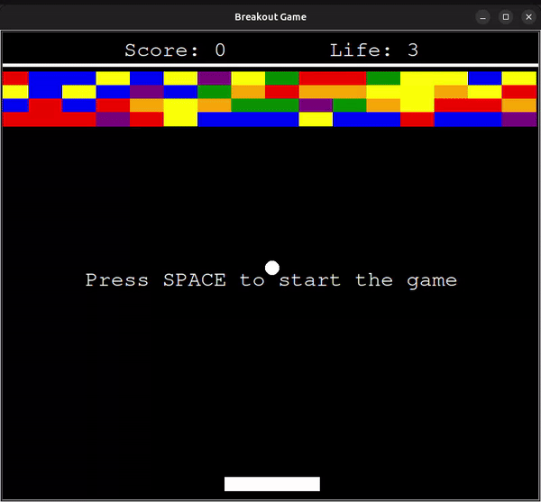

# Breakout Game 🎮

Welcome to the **Breakout Game** – a classic brick-breaking arcade game built with Python's Turtle Graphics module. This project is designed to bring nostalgic gameplay with added interactive features and smooth animation for an enjoyable user experience. Test your reflexes as you control the paddle, break bricks, and aim for the highest score!

## 🎲 Game Features

- **Smooth Paddle Movement**: Precise paddle control allows easy left and right movement for better gameplay.
- **Realistic Collision Detection**: Detects ball collisions with walls, the ceiling, the paddle, and bricks.
- **Dynamic Brick Layout**: Bricks are arranged in a grid with multiple rows and colorful patterns.
- **Score Tracking**: Earn points for each brick you break and keep track of lives remaining.
- **Level Reset**: When all bricks are destroyed or lives are lost, the game resets with a fresh brick layout.

## 🚀 Getting Started

### Prerequisites

- **Python 3.x** installed on your computer.
- **Turtle Graphics Module** (usually included with Python).

### Installation

1. **Clone the Repository**
   ```bash
   git clone https://github.com/yourusername/breakout-game
   cd breakout-game
   ```

2. **Run the Game**
   ```bash
   python main.py
   ```

### Controls

- **Left Arrow Key**: Move the paddle left.
- **Right Arrow Key**: Move the paddle right.
- **Spacebar**: Start or restart the game.

## 📂 Project Structure

```
/breakout-game
├── main.py                # Main game loop
├── ball.py                # Ball class with movement and collision logic
├── paddle.py              # Paddle class for player control
├── brick.py               # Brick class for brick grid generation
├── scoreboard.py          # Scoreboard for tracking score and lives
└──border.py               # Border for game boundary setup
```

## 🛠️ Key Components

- **`Ball`**: Manages ball movement, collision with walls, paddle, and bricks.
- **`Paddle`**: Controls player movement and boundary constraints.
- **`Brick`**: Generates a grid of colorful bricks and handles brick removal on collision.
- **`Scoreboard`**: Displays current score and lives remaining, and shows game over or victory messages.

## 🎉 Gameplay

Press `Space` to start the game. Use the arrow keys to move the paddle and keep the ball in play. Destroy all bricks to win the game or try again if you lose all lives.

---

---

## Enjoy the challenge, and happy brick-breaking!
